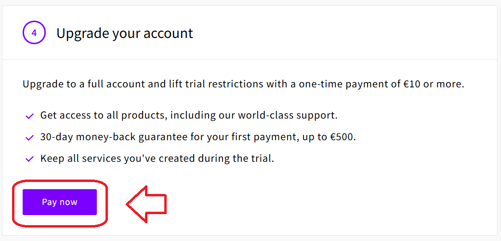
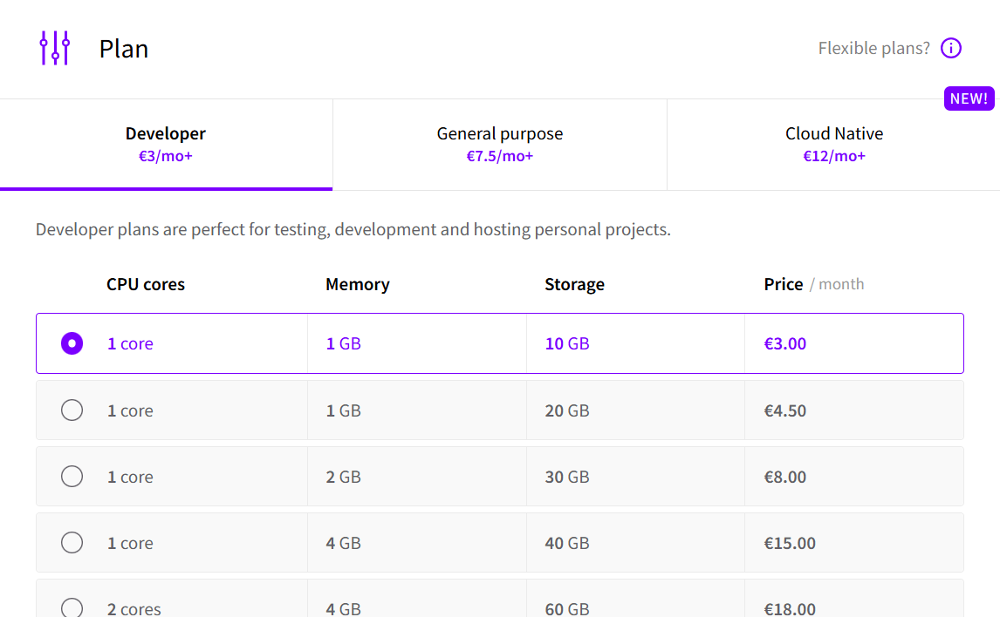
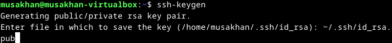
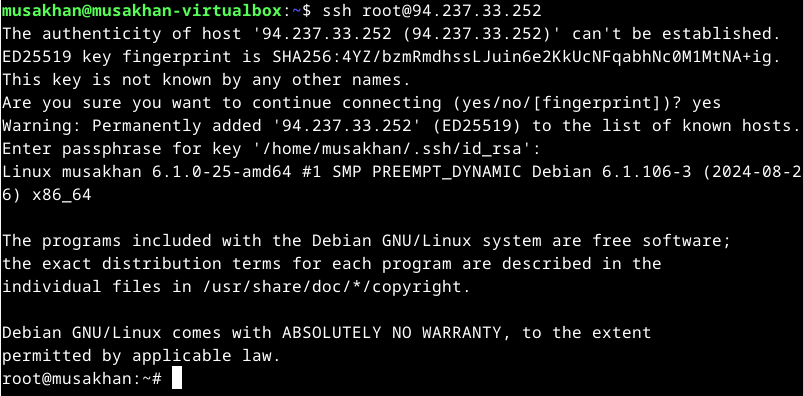
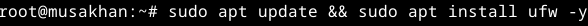

## z)
## Teoriasta käytäntöön pilvipalvelimen avulla (h4)
a) Pilvipalvelimen vuokraus ja asennus
Palvelin vuokrattiin DigitalOceanista ja domain Namecheapista GitHub Education -paketin avulla.
Rekisteröinti vaati luottokorttitietojen syöttämisen ja henkilöllisyyden varmistamisen.
Virtuaalikone luotiin DigitalOceanissa (Debian 11 x64, peruspaketti 5 $/kk).
Datakeskukseksi valittiin Amsterdam.
Domainin DNS-asetukset konfiguroitiin osoittamaan palvelimelle.

d) Palvelin suojaan palomuurilla
SSH-yhteys otettiin palvelimeen ja päivitykset tarkistettiin.
UFW-palomuuri asennettiin ja aktivoitiin.
SSH-portti (22) sallittiin palomuurissa ($ sudo ufw allow 22/tcp, $ sudo ufw enable).
Palomuuri otettiin käyttöön estämään tarpeettomat yhteydet.

e) Kotisivut palvelimelle
Apache-webpalvelin asennettiin ($ sudo apt-get install apache2).
Apache-testisivu vaihdettiin omaksi "Hello world!" -sivuksi.
Käyttäjän kotihakemistoon (public_html) luotiin julkinen kansio ja sivu.
HTML-sivusto luotiin ja testattiin selaimella.

f) Palvelimen ohjelmien päivitys
Ohjelmistopäivitykset haettiin ja asennettiin komentoina:
$ sudo apt-get update
$ sudo apt-get upgrade
$ sudo apt-get dist-upgrade
Tietoturvapäivitykset suoritettiin varmistaen, että palvelin pysyy suojattuna.

## First Steps on a New Virtual Private Server – an Example on DigitalOcean and Ubuntu 16.04 LTS

Virtuaalipalvelimen luonti: Rekisteröidy DigitalOceaniin, lisää maksutiedot ja luo uusi Ubuntu 16.04 LTS -palvelin.
Valitse palvelimen sijainti asiakaslähtöisesti.
Kirjaudu ensimmäistä kertaa sisään root-käyttäjänä ($ ssh root@IP-OSOITE).
Palomuuri (UFW) asennus ja käyttöönotto

Avaa SSH-portti (22) ennen palomuurin aktivointia:
$ sudo ufw allow 22/tcp
$ sudo ufw enable
Käyttäjän luonti ja root-käyttäjän lukitseminen

Luo uusi käyttäjä ja anna sille sudo-oikeudet:
$ sudo adduser tero
$ sudo adduser tero sudo
Testaa käyttäjätunnuksen toiminta ennen root-käyttäjän lukitsemista.
Estä root-kirjautuminen SSH:lla muokkaamalla /etc/ssh/sshd_config:
PermitRootLogin no
Ohjelmistopäivitykset ja tietoturva

Päivitä kaikki ohjelmat heti palvelimen käyttöönoton jälkeen:
$ sudo apt-get update
$ sudo apt-get upgrade
DNS-nimen määrittäminen (NameCheap/Gandi)

Lisää domain-palvelun hallinnasta "A record" osoittamaan palvelimen IP-osoitteeseen.
Testaa DNS-nimi komennolla host example.com dns1.registrar-servers.com.
Palvelimen käyttöönotto

Asenna ja käynnistä julkinen palvelin, kuten Apache.
Lisää palomuurin sääntö (esim. $ sudo ufw allow 80/tcp).
Käyttöönoton jälkeen palvelin on valmis käytettäväksi.

## a)

Päätin valita UpCloudin palveluntarjoajakseni ja ostin sieltä tilauksen, koska uskon sen olevan hyödyllinen koko Linux-kurssin ajan sekä sen jälkeen. 

Sivusto kehotti ottamaan käyttöön kaksivaiheisen tunnistautumisen, joten lisäsin sivuston Google Authenticatoriini.

   

Nytten luodaan serverin meidän webpalvelimelle.

       

Ei ole mitään erikoista tähän hetkeen. Valitsemme sopivat kohdat itselleen. Käytän Debianille serverin.

Luodaan SSH avaimen. Ensin ladataan ssh (unohdin, että pitää käyttää openssh-client, mutta ei ole merkitystä kuten ymmärsin myöhemmin.) Ja sitten ssh-keygen avulla luodaan avaimen.

   

cat kommennolla olen selvinnyt tarkka kirjoitusta, ja lisäsin sen laatikkoon UpCloudissa. 

  

Nimitän hostname ja serverin.

 

## b

Menen kirjautumaan root kautta. Ja päivitin kaikki. Lataan palomuurin ja tarkistin kunnossa olevana.

    

Luodaan uuden user. Annan hänelle sudo-oikeudet. Tein uuden salasanan.

   

Kokeilin päästä uuden userin kautta, mutta ei onnistu. Jenni Muhosella oli sama ongelma (https://github.com/jennimuhonen/linux-kurssi/blob/main/h4_maailma_kuulee.md), ja menen tarkistamaan että molemilla kansiossa ssh-avaimen olemisen. 

   

Luodaan saman avaimen meidän fyysiseen kansion. 

 

Mutta uudelleen näytössä oli päästön kielto.

 

Luulen että tarvitaan poistaa root käytännöstä, mutta se oli vika. En päässyt sekä root sekä uuteen useriin.
 

Poistin serverin kokonaan, ja tein uuden. Poistin vanhan ssh-avaimen, ja tein uuden. Kuten ymmärsin vanhassa ssh-avaimessa oli vahingossa laitettu tarpeton välilyöntia. Mutta nyt pääsen uuden serverin.

  

Päivitin kaiken tarvittaessa.

 

## C

Olen ladannut apache2. Päivitin palomuurin lisämällä uusia sääntöjä apache2 takia. Tarkisin apachen toiminnan.
   

Olen luonnut uuden sivun ja tarkistin selaimella ja kännykällä. Se toimii.

  

Halusin laittaa omalle julkiselle palvelimellesi uusi Name Based Virtual Host, mutta ei onnistunut. Varmasti pitää laitaa tiettyyn kansion, mutta ei ymmärtänyt minne. 

  

## LÄHTEET

- Susanna Lehto 2022: Teoriasta käytäntöön pilvipalvelimen avulla (h4). https://susannalehto.fi/2022/teoriasta-kaytantoon-pilvipalvelimen-avulla-h4/
- Karvinen, Tero 2012: First Steps on a New Virtual Private Server – an Example on DigitalOcean and Ubuntu 16.04 LTS. https://terokarvinen.com/2017/first-steps-on-a-new-virtual-private-server-an-example-on-digitalocean/
- Pranita 2.11.2023: How to Fix SSH Permission Denied (Publickey) Error. https://www.redswitches.com/blog/ssh-permission-denied/
- Jenni Muhonen 2024: Maailma kuulee (h4). https://github.com/jennimuhonen/linux-kurssi/blob/main/h4_maailma_kuulee.md
